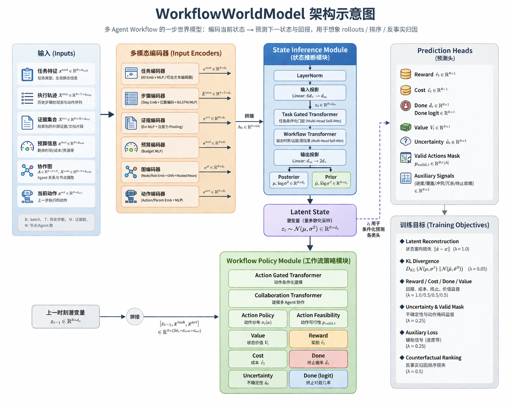

# Workflow World Model Dataset README

## 1. 这个数据集是做什么的

`workflow_world_model.jsonl` 是给 `WorkflowWorldModel` 训练使用的离线数据集。

它不是普通问答数据，也不是单纯的工具调用日志，而是把当前多智能体系统的一次执行过程整理成了 step-level transition 样本。

每一行近似对应一个强化学习/世界模型里的 transition：

```text
(s_t, a_t, s_{t+1}, r_t, info_t)
```

其中：

- `s_t`：scheduler 在做当前决策时看到的状态
- `a_t`：scheduler 选中的 agent/action
- `s_{t+1}`：执行该动作之后，真实 workflow 到达的下一状态
- `r_t`：该 step 对应的 reward 信号
- `info_t`：额外监督信息，如 token、cost、credit、辅助状态目标

## 2. 为什么要单独构造这个数据集

当前系统原本更偏向在线执行：

- scheduler 负责选择 agent
- agent 负责执行工具/推理动作
- workflow 负责记录执行结果

但如果想训练世界模型、做 imagined rollout、做 counterfactual credit 或 planner rerank，仅仅保留最终答案是不够的。

世界模型需要知道：

1. 在某个状态下选了哪个 agent
2. 这个 agent 执行之后，状态发生了什么变化
3. 这一步的 reward/cost/done/uncertainty 大概是什么

所以必须把在线执行过程转换成更标准的 transition 数据格式。

## 3. 数据是如何生成的

数据由：

- [REINFORCE_continuous.py](puppeteer/inference/policy/REINFORCE_continuous.py)
- [workflow_dataset_recorder.py](puppeteer/inference/policy/workflow_dataset_recorder.py)

共同生成。

### 3.1 采集时机

第一步：在 scheduler 做出决策前，记录当前 `state`

- 入口：`capture_decision_state(global_info)`
- 含义：记录真实的 `s_t`

第二步：把选中的动作和候选信息挂到 trajectory 上

- 记录：
  - `state_snapshot`
  - `candidate_agents`
  - `selected_confidence`

第三步：任务结束后，在 `finalize_task()` 中利用真实 workflow 回填

- 生成：
  - `next_state`
  - `reward`
  - `cost_delta`
  - `done`
  - `returns`
  - `credit_targets`

### 3.2 为什么在 policy 层采集

不把 recorder 放在单个 agent 层的原因是：

- agent 层只看到局部执行过程
- policy 层同时能看到：
  - 决策前状态
  - scheduler 候选集合
  - 真实整条路径的奖励归因

对于世界模型训练来说，policy 层才是最完整的观察点。

## 4. JSONL 文件位置

默认情况下，文件会追加写入当前任务对应的 `workpath` 目录下：

```text
<workpath>/workflow_world_model.jsonl
```

现在支持通过超参数显式配置输出目录：

```json
"world_model_dataset": {
  "enabled": true,
  "output_dir": "results/world_model_dataset",
  "use_dataset_subdirs": true,
  "split_by_time": true,
  "time_granularity": "day",
  "filename": "workflow_world_model.jsonl"
}
```

当前写入优先级如下：

1. 如果配置了 `world_model_dataset.output_dir`
   会写入：

```text
<output_dir>/<filename>
```

2. 如果没有配置 `output_dir`
   则回退到原来的行为：

```text
<workpath>/<filename>
```

文件名由 `config/policy.json` 中的 `world_model_dataset.filename` 控制。

### 4.1 按 `dataset_name/dataset_mode` 自动分子目录

如果：

```json
"use_dataset_subdirs": true
```

则 recorder 会在输出目录下自动增加两级子目录：

```text
<base_output_dir>/<dataset_name>/<dataset_mode>/<filename>
```

这里的 `dataset_name` 和 `dataset_mode` 来源优先级为：

1. `world_model_dataset.dataset_name` / `world_model_dataset.dataset_mode`
2. 顶层 `policy.json` 里的 `dataset_name` / `dataset_mode`
3. 任务对象 `task` 中的 `dataset_name` / `dataset_mode` / `type` / `mode`

如果某一级不存在，则跳过该层。

例如当前配置下，最终路径可能变成：

```text
results/world_model_dataset/MMLU-Pro/validation/workflow_world_model_20260331.jsonl
```

### 4.2 按日期时间自动切分数据文件

如果：

```json
"split_by_time": true
```

则 recorder 不再持续写入同一个固定文件，而是会根据 `time_granularity` 给文件名追加时间后缀。

支持的粒度：

- `"day"` -> `YYYYMMDD`
- `"hour"` -> `YYYYMMDD_HH`
- `"minute"` -> `YYYYMMDD_HHMM`
- `"second"` -> `YYYYMMDD_HHMMSS`

例如：

```json
"filename": "workflow_world_model.jsonl",
"split_by_time": true,
"time_granularity": "day"
```

生成的文件名会是：

```text
workflow_world_model_20260331.jsonl
```

如果 `time_granularity` 是 `"hour"`，则可能是：

```text
workflow_world_model_20260331_14.jsonl
```

### 4.3 推荐配置方式

如果你准备长期做实验，我建议用下面这种组合：

```json
"world_model_dataset": {
  "enabled": true,
  "output_dir": "results/world_model_dataset",
  "use_dataset_subdirs": true,
  "split_by_time": true,
  "time_granularity": "day",
  "filename": "workflow_world_model.jsonl"
}
```

这样你会得到类似下面的路径结构：

```text
results/world_model_dataset/
  MMLU-Pro/
    validation/
      workflow_world_model_20260331.jsonl
  gsm-hard/
    validation/
      workflow_world_model_20260331.jsonl
```

相关配置见：

- [policy.json](puppeteer/config/policy.json)

## 5. 单条记录的字段说明

下面是当前 recorder 输出的一条样本大致结构：

```json
{
  "episode_id": "...",
  "path_id": 0,
  "t": 3,
  "task": {...},
  "graph": {...},
  "state": {...},
  "next_graph": {...},
  "next_state": {...},
  "action": {...},
  "next_state_targets": {...},
  "outcome": {...},
  "returns": {...},
  "credit_targets": {...},
  "metadata": {...}
}
```

下面分别解释。

### 5.1 `episode_id`

标识当前 trajectory 所属的 episode。

作用：

- 训练/验证集切分时按 episode 分组
- 避免同一条轨迹泄漏到 train 和 val 两边

### 5.2 `path_id`

当前样本所属的 path 编号。

作用：

- 区分多路径并行探索得到的分支

### 5.3 `t`

当前 step 在该 path 中的时间步。

作用：

- 用于恢复时序关系
- 可用于训练时做 step embedding 或时间分析

### 5.4 `task`

任务级别信息。

常见字段：

- `Question` 或 `question`
- `task_type`
- `constraints`

作用：

- 提供任务语义先验
- 告诉世界模型当前任务类别与预算条件

### 5.5 `graph`

执行动作之前的 agent graph 快照。

包含：

- `nodes`
- `edges`
- `node_stats`

其中 `node_stats` 里通常有：

- `success_rate`
- `avg_cost`
- `avg_credit`
- `avg_reward`
- `usage_count`

作用：

- 为 graph-conditioned world model 提供结构化条件输入

### 5.6 `state`

动作执行前的状态，也就是 `s_t`。

通常包含：

- `workflow_state`
- `executed_steps`
- `recent_answers`
- `reasoning_results`
- `tool_results`
- `all_actions`
- `valid_actions`
- `budget`
- `path_id`

其中：

- `executed_steps` 是结构化的历史 step 列表
- `budget` 记录当前已经消耗的 tokens/cost/step_index

作用：

- 这是世界模型编码当前 observation 的主要输入

### 5.7 `next_graph`

执行当前动作之后对应的图快照。

当前版本里大多数样本的 `next_graph` 与 `graph` 相同，因为还没有真正启用 graph mutation。

但这个字段提前保留了后续扩展空间。

### 5.8 `next_state`

执行当前动作后的状态，也就是 `s_{t+1}`。

作用：

- 监督世界模型的 prior 预测是否接近真实 next-state 编码

训练脚本里会把它变成 `next_batch` 使用。

### 5.9 `action`

当前 step 的动作信息，也就是 `a_t`。

通常包含：

- `kind`
  - `primitive`
  - `macro`
  - `mutation`
- `name`
- `selected_confidence`
- `estimated_cost`
- `candidate_agents`

作用：

- 给 transition model 提供条件变量
- 也保留了 scheduler 本身的决策上下文

### 5.10 `next_state_targets`

当前版本的 dense supervision。

通常包含：

- `progress_score`
- `coverage_score`
- `conflict_score`
- `redundancy_score`
- `termination_readiness`
- `valid_action_mask`

这些量目前主要由 recorder 启发式构造。

作用：

- 帮助世界模型学习更密集的中间状态变化
- 在最终 reward 稀疏时尤其有用

### 5.11 `outcome`

当前 step 的直接结果。

常见字段：

- `reward`
- `cost_delta`
- `token_delta`
- `done`
- `success`

作用：

- 提供直接环境级监督
- 供 `reward_head/cost_head/done_head` 学习

### 5.12 `returns`

由 recorder 回填的回报目标。

常见字段：

- `mc_return`
- `h2_return`

作用：

- 给 `value_head` 或短视距估值提供目标

### 5.13 `credit_targets`

与 credit assignment 有关的目标。

当前常见字段：

- `leave_one_out_gap`
- `step_credit`

作用：

- 为反事实 credit / importance ranking 提供监督

### 5.14 `metadata`

人类阅读和分析更方便的补充信息。

比如：

- `agent_role`
- `action_name`
- `action_parameter`
- `result_summary`
- `answer_summary`
- `metrics`

它通常不会直接作为世界模型的主输入，但对调试和 error analysis 很有帮助。

## 6. 这个数据集如何被训练脚本使用

训练脚本见：

- [train_workflow_world_model.py](puppeteer/train_workflow_world_model.py)

它会做以下事情：

1. 递归搜索 `workflow_world_model.jsonl`
2. 读取所有记录
3. 按 `episode_id` 切分 train/val
4. 用 `WorkflowStateAdapter` 扫描词表
5. 构造：
   - 当前 `batch`
   - 对应的 `next_batch`
6. 训练 `WorkflowWorldModel`

其中：

- `batch` 来自当前 record 的 `state/graph/action`
- `next_batch` 来自同一 record 的 `next_state/next_graph`

## 7. 和世界模型训练目标的对应关系

### 7.1 latent transition loss

用：

- 当前 `state`
- 当前 `action`

预测 prior next latent，再和 `next_state` 编码结果对齐。

### 7.2 reward/cost/done/value loss

用：

- `outcome`
- `returns`

做监督。

### 7.3 valid action / aux loss

用：

- `next_state_targets`

做 dense supervision。

### 7.4 counterfactual loss

用：

- `credit_targets`

约束 Q/credit 相关排序。

## 8. 当前版本的数据集局限

需要明确说明，当前 recorder 输出仍然是第一版原型：

1. `next_state_targets` 主要是启发式构造
2. `counterfactual_credit` 还不是严格的因果估计
3. `next_graph` 在大多数样本里还没体现真实 graph mutation
4. 文本信息暂时只保留摘要和统计特征，不是高维语义 embedding

这不影响先打通实验链路，但如果你要写论文，需要后续继续增强：

- judge model 打标签
- counterfactual branch rollout
- macro-action / graph mutation 样本
- 更强的 state semantic encoder

## 9. 推荐实验使用流程

### 第一步：先跑任务，采集日志

让现有系统正常跑 benchmark，确保每个 `workpath` 下生成：

```text
workflow_world_model.jsonl
```

### 第二步：检查 JSONL 是否合理

建议抽查：

- `state` 是否真的是动作前状态
- `next_state` 是否真的是动作后状态
- `reward/cost/done` 是否和真实 workflow 一致
- `episode_id/path_id/t` 是否正确

### 第三步：离线训练世界模型

运行：

```bash
cd puppeteer
python train_workflow_world_model.py --data-root results
```

### 第四步：把世界模型接回 planner/reranker

训练好后，可以先做最简单的版本：

- LLM 提供候选 agent
- 世界模型 imagined rollout 对候选做重排

这是最稳的第一步。

## 10. 后续最值得扩展的方向

1. 增加真实反事实分支数据
2. 让 `next_graph` 支持真实 graph mutation
3. 引入 macro-action 数据
4. 用更强 encoder 替换轻量文本统计特征
5. 增加 uncertainty ensemble

## 11. 相关代码入口

### 11.1 快速统计数据集规模

如果你想快速统计某个数据集目录下已经采集了多少条样本，可以运行：

```bash
cd puppeteer
python count_world_model_dataset.py --data-root results/world_model_dataset
```

如果你只想看某个子目录，比如：

```bash
python count_world_model_dataset.py --data-root results/world_model_dataset/MMLU-Pro/validation
```

如果还想打印每个文件各自的样本量：

```bash
python count_world_model_dataset.py --data-root results/world_model_dataset --show-files
```

这个脚本会输出：

- 扫描到的文件数
- 总样本数
- 总 episode 数
- path 分布
- 最常见 action
- 最常见 task type

- 数据采集器  
  [workflow_dataset_recorder.py](puppeteer/inference/policy/workflow_dataset_recorder.py)

- 世界模型  
  [workflow_world_model.py](puppeteer/inference/policy/workflow_world_model.py)

- 离线训练脚本  
  [train_workflow_world_model.py](puppeteer/train_workflow_world_model.py)

- 调度器接线位置  
  [REINFORCE_continuous.py](puppeteer/inference/policy/REINFORCE_continuous.py)

## 12. 世界模型结构说明

下图展示了 `WorkflowWorldModel` 的整体结构：



对应实现见：

- [workflow_world_model.py](puppeteer/inference/policy/workflow_world_model.py)

这个模型可以分成 5 个部分：

- 输入表示层
- 观测编码与 posterior latent
- transition 与 prior latent
- 多任务预测头
- 训练监督与反事实信用估计

### 12.1 输入表示层

`WorkflowStateAdapter` 负责把 recorder 采样出来的 JSONL 记录转换成定长张量 batch。

对应代码：

- [workflow_world_model.py](puppeteer/inference/policy/workflow_world_model.py) line 730 
它会把一条 transition 拆成以下几类输入：

- `task_features` / `task_text_input_ids`
  - 当前任务题面或问题描述
  - 默认可以用轻量数值特征表示，也可以切换到 LLM 文本编码
- `task_type_ids`
  - 任务类型，例如不同数据集或任务模式
- `workflow_state_ids`
  - 当前 workflow 所处的离散状态
- `step_role_ids`、`step_action_ids`、`step_features`
  - 历史执行轨迹
  - 包括 agent、action、tokens、cost、step summary 等
- `evidence_type_ids`、`evidence_features` / `evidence_text_input_ids`
  - 当前可见证据集合
  - 包括 reasoning results、tool results、recent answers
- `budget_features`
  - 预算和资源使用状态
  - 例如 step index、used tokens、used cost、budget constraint
- `graph_node_ids`、`graph_node_features`、`graph_adj`
  - 多 agent 协作图
  - 包括节点统计和边结构
- `action_kind_ids`、`action_name_ids`、`action_features`
  - 当前动作本身，作为 transition 条件输入

这一步对应架构图左侧的输入块：

- `Task Features`
- `Step Sequence`
- `Evidence Set`
- `Budget Features`
- `Collaboration Graph`
- `Action Encoder`

### 12.2 Task Encoder

任务编码器负责把当前题面或问题描述编码成任务级表示。

对应代码：

- [workflow_world_model.py](puppeteer/inference/policy/workflow_world_model.py) line 493 
当前有两种模式：

- 默认模式
  - 使用 `task_projection`
  - 把 `task_features` 这种低维数值特征映射到 `model_dim`
- LLM 模式
  - 使用 `HFTextEncoder`
  - 先对题面做 tokenizer 和 Qwen 编码，再通过 `task_text_projection` 投影到 `model_dim`

它在架构图中对应 `Task Encoder`。

### 12.3 Sequence Encoder

`SequenceEncoder` 负责对历史 step 序列做编码。

对应代码：

- [workflow_world_model.py](puppeteer/inference/policy/workflow_world_model.py) line 230 
它的输入包括：

- 执行动作的 agent id
- 动作 id
- step 数值特征

内部做法是：

- 先做 role embedding
- 再做 action embedding
- 再把数值特征投影到 `model_dim`
- 拼接后送入 `TransformerEncoder`
- 最后做 masked mean pooling，得到整个轨迹的一个向量

它在架构图中对应 `Sequence Encoder`，用于编码 `Step Sequence`。

### 12.4 Evidence Encoder

`SetEncoder` 负责对证据集合做无序聚合。

对应代码：

- [workflow_world_model.py](puppeteer/inference/policy/workflow_world_model.py) line 260 
输入证据主要有三类：

- `reasoning`
- `tool`
- `answer`

每条证据先做：

- type embedding
- feature projection 或 LLM 文本投影

然后再做 masked mean pooling，得到一个证据集合表示。

它在架构图中对应 `Evidence Set -> Sequence Encoder` 这一路，实际代码里是集合编码器，不是时序编码器。

### 12.5 Budget Encoder

预算编码器负责表示当前资源消耗状态。

对应代码：

- [workflow_world_model.py](puppeteer/inference/policy/workflow_world_model.py) line 415 
输入包括：

- 当前 step index
- used tokens
- used cost
- budget constraint

输出的是一个 `budget_repr`，用于告诉世界模型当前还剩多少“执行空间”。

它在架构图中对应 `Budget Encoder`。

### 12.6 Graph Encoder

`GraphEncoder` 负责对多 agent 协作图做编码。

对应代码：

- [workflow_world_model.py](puppeteer/inference/policy/workflow_world_model.py) line 277 
输入包括：

- 节点 id
- 节点统计特征
- 邻接矩阵

内部逻辑是：

- 先对节点角色做 embedding
- 再把节点统计特征投影到 `model_dim`
- 然后做多层“邻居聚合 + 自身更新”
- 最后对整张图做 masked mean pooling

输出的 `graph_repr` 表示当前 agent 生态和协作拓扑。

它在架构图中对应 `Graph Encoder`。

### 12.7 Action Encoder

动作编码器负责把当前动作编码成 transition 的条件向量。

对应代码：

- [workflow_world_model.py](puppeteer/inference/policy/workflow_world_model.py) line 479 
输入包括：

- 动作类型 `kind`
- 动作名称 `name`
- 少量动作数值特征

输出的 `action_repr` 不参与 posterior 编码，而是进入 transition 模块，告诉模型“从当前状态是执行了哪个动作才走到下一状态”。

它在架构图中对应 `Action Encoder`。

### 12.8 Observation Fusion

`Observation Fusion` 是整个观测编码阶段的中心模块。

对应代码：

- [workflow_world_model.py](puppeteer/inference/policy/workflow_world_model.py) line 433
- [workflow_world_model.py](puppeteer/inference/policy/workflow_world_model.py) line 536 
它会把以下表示拼接起来：

- task 表示
- task type embedding
- workflow state embedding
- step 序列表征
- evidence 表示
- budget 表示
- graph 表示
- previous hidden state

再经过两层 MLP，得到融合后的当前观测表示 `fused`。

它的作用是：

- 把所有模态的信息压缩成统一状态表示
- 为 posterior latent 编码提供输入
- 为下一步 hidden state 更新提供输入

它在架构图中对应中间的 `Observation Fusion`。

### 12.9 Previous Hidden State 与 Transition GRU

模型内部维护一个 `hidden_state`，用于表示跨 step 的内部记忆。

对应代码：

- [workflow_world_model.py](puppeteer/inference/policy/workflow_world_model.py) line 557
- [workflow_world_model.py](puppeteer/inference/policy/workflow_world_model.py) line 575
- [workflow_world_model.py](puppeteer/inference/policy/workflow_world_model.py) line 594 
这里有两层状态更新：

- `hidden_adapter`
  - 根据当前观测融合结果更新 `next_hidden`
  - 它更像 posterior 侧的 hidden 更新
- `transition_cell`，也就是 `GRUCell`
  - 接收 `latent + action_repr + graph_repr`
  - 生成 prior 侧的 `prior_hidden`

它们在架构图中分别对应：

- `Previous Hidden State`
- `Transition GRU`

### 12.10 Posterior Encoder 与 Posterior Latent

posterior 编码器负责基于当前真实观测生成当前时刻 latent。

对应代码：

- [workflow_world_model.py](puppeteer/inference/policy/workflow_world_model.py) line 575
- [workflow_world_model.py](puppeteer/inference/policy/workflow_world_model.py) line 576 
具体做法是：

- 从 `fused` 通过 `posterior_head` 生成
  - `post_mean`
  - `post_logvar`
- 再通过 `_sample_latent()` 得到 `latent`

这部分在架构图中对应：

- `Posterior Encoder`
- `Posterior Latent`
- `Latent Mean`
- `Latent Logvar`

这个 latent 可以理解为“模型对当前观测状态的压缩信念表示”。

### 12.11 Prior Latent

prior latent 负责预测“执行当前动作后，下一步潜在状态会是什么样”。

对应代码：

- [workflow_world_model.py](puppeteer/inference/policy/workflow_world_model.py) line 594
- [workflow_world_model.py](puppeteer/inference/policy/workflow_world_model.py) line 596 
生成路径是：

- 当前 `latent`
- 当前 `action_repr`
- 当前 `graph_repr`
- 送入 `transition_cell`
- 再经过 `prior_head`
- 得到
  - `prior_mean`
  - `prior_logvar`

它在架构图中对应 `Prior Latent`。

训练时，prior 会和真实下一状态编码出的 posterior 对齐，从而学会动力学。

### 12.12 Reward / Cost / Done / Value / Uncertainty Heads

这些头都基于同一个 `head_input`：

- `prior_mean`
- `graph_repr`
- `prior_hidden`

对应代码：

- [workflow_world_model.py](puppeteer/inference/policy/workflow_world_model.py) line 598
- [workflow_world_model.py](puppeteer/inference/policy/workflow_world_model.py) line 611 
每个头的作用如下：

- `Reward Head`
  - 预测下一步 reward
- `Cost Head`
  - 预测下一步 cost
- `Done Head`
  - 预测是否终止
- `Value Head`
  - 预测状态价值
- `Uncertainty Head`
  - 预测不确定性或冲突程度

这些头共同决定世界模型是否不仅能预测“状态怎么变”，还能预测“变完以后值不值得”。

### 12.13 Valid Action Head

`Valid Action Head` 预测下一时刻哪些动作是可执行或合理的。

对应代码：

- [workflow_world_model.py](puppeteer/inference/policy/workflow_world_model.py) line 616 
输入是：

- `prior_mean`
- `graph_repr`

输出是一个多标签 logits 向量，对应动作词表上的每个候选动作。

它的作用是：

- 约束世界模型不要在 rollout 中给出明显无效动作
- 给 planner 或 reranker 提供动作可行性先验

### 12.14 Auxiliary Heads

辅助头用于预测中间结构性目标，而不只是 reward。

对应代码：

- [workflow_world_model.py](puppeteer/inference/policy/workflow_world_model.py) line 456
- [workflow_world_model.py](puppeteer/inference/policy/workflow_world_model.py) line 600 
当前默认包括：

- `progress_score`
- `coverage_score`
- `conflict_score`
- `redundancy_score`
- `termination_readiness`

它们的作用是：

- 提供更密集的监督信号
- 帮助 latent 学到 workflow 的结构性状态
- 让模型在 reward 很稀疏时仍然能得到训练信号

它们在架构图中对应 `Auxiliary Heads`。

### 12.15 Counterfactual Credit Loss

反事实信用估计不是单独的一个前向头块，而是一种训练目标。

对应代码：

- [workflow_world_model.py](puppeteer/inference/policy/workflow_world_model.py) line 658
- [workflow_world_model.py](puppeteer/inference/policy/workflow_world_model.py) line 719 
当前实现里：

- 先用 `q_value()` 近似一步 Q 值
  - `reward - cost + gamma * value`
- 再与 `counterfactual_credit` 做监督
- 同时包含
  - 数值拟合项
  - 排序拟合项

它的作用是：

- 让模型不仅学“结果是什么”
- 还学“当前动作或 agent 对结果贡献了多少”

这就是架构图底部 `Counterfactual Credit Loss` 的含义。

### 12.16 整体信息流

结合架构图和代码，整个世界模型的工作流程可以概括为：

1. `WorkflowStateAdapter` 把 JSONL transition 转成张量 batch
2. 各个 encoder 分别编码 task、steps、evidence、budget、graph
3. `Observation Fusion` 融合当前观测和 previous hidden state
4. `posterior_head` 生成当前真实观测对应的 posterior latent
5. `Action Encoder + Transition GRU + prior_head` 预测下一步 prior latent
6. 各个 heads 基于 prior 预测 reward/cost/done/value/uncertainty/valid actions/aux targets
7. 训练时再用真实下一状态编码结果监督 prior，并加入 counterfactual credit loss

这个设计的目标是让模型同时具备三种能力：

- 状态建模
- 动作后果预测
- 策略评估与信用分配

## 13. 训练侧数据卫生规则

当前建议是：

- recorder JSONL 保持尽量完整，允许保留 `task.Answer` 这类 gold 字段，方便复盘、评测和人工检查
- 世界模型训练时不读取 `task.Answer`，只读取 `question/Question` 等可观察输入
- `cost_delta`、`token_delta`、`used_cost`、`used_tokens`、`estimated_cost` 在 JSONL 中保留原始量纲
- 这些大尺度数值在 `WorkflowStateAdapter` 中做归一化后再送入模型

这样处理的原因是：

- 数据存档层应该尽量无损，避免后续分析时缺字段
- 训练层应该显式避免标签泄漏
- 数值归一化应当发生在模型输入侧，而不是污染原始日志
